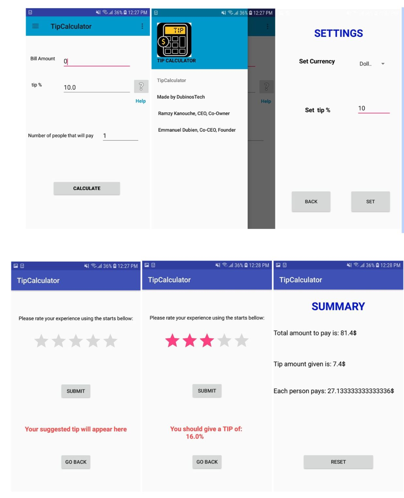

# TipCalculator
## Description
TIP Calculator is an android app that calculates the tip amount to pay at a restaurant. 

Since we are primarily interested in the development of User Interfaces (UIs), we will describe the application in terms of UIs screens and menus. 

Note that this is not the ideal method to capture software requirements; nonetheless, it should be sufficient for a simple application. 

The application's Graphical User Interface (GUI) is composed of the following screens and menus:

## Features
* Calculates tip amount. 
* Gives tip suggestions.
* Display summary of the bill

## FrontEnd Development Environment Setup Guide

Please follow those instruction fto set up your local work environment for the front-end. 

1. Download Android studio: https://developer.android.com/studio 
2. Clone the repo using HTTPS or SSH: `$ git clone https://github.com/DubinosTech/TipCalculator
3. Open the project on Android studio and you are good to go. 

Learn more about Android studio and Android developement: https://developer.android.com/guide
